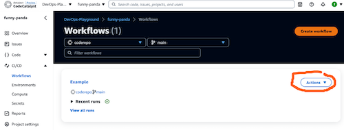
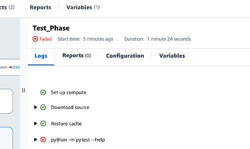

# Exercise 2

[(_back to main readme_)](../README.md)

We've created a workflow which has executed to build our initial environment
***Please shout if you didn't get a successful run before we continue***.
Now we're going to add an action to perform some tests on our python code.

We'll be pasting various commands - these are available in the `README.me` in the `step2` folder of the repository.

---
1. Click `CI/CD` in the navigation column, then `Workflows`. You'll be able to see the workflow `Example` we created in the previous step. Click `Actions`, and from the dropdown, choose `Edit`.



2. Again, this will open in the YAML editor, which we will use this time. Scroll down to the bottom of the editor


3. Paste the following text into the editor below the line `Type: EC2`
```
  Test_Phase:
    Identifier: aws/managed-test@v1
    Inputs:
      Sources:
        - WorkflowSource
    Outputs:
      AutoDiscoverReports:
        Enabled: false
        ReportNamePrefix: rpt
    Configuration:
      Steps:
        - Run: |
            python -m pytest --help
    Compute:
      Type: EC2
    DependsOn:
      - Init
```
4. Click on `Validate` at the top of the screen to ensure our code is ok.
5. Click `Commit` at the top of the screen.


  * Specify a name to use for the yaml file that will hold the workflow definition
  *   Add an appropriate commit message
  *   Click on repo dropdown and select the repo
  *   Click `main` for the branch name from the drop-down
  *   Click on the `Commit` button.
6. After a short delay, you'll be returned to the main Workflow screen and you should see a new step for the test phase, and some information about the workflow. Click on `Runs`


7. Check in either `Active Runs` or `Run history` and you should see a run that is in progress, or just completed. Find the latest run and click on the run id to view the results.


1. Once you've opened the run, wait until the test phase is showing as failed.


9. Click on the `Test_Phase` box to open the details. You should see that the action failed at the python step. Click on the arrow next to the step to open it and see the error message.



10. You should see the step has failed due to python not being able to find the `pytest` library.


---

## So why did we fail?
When CodeCatalyst runs a new action, each one opens in a separate container. This means that any files generated will be lost unless we explicitly archive them and transfer them to the new action - so let's do that.

1. At the top of the screen, click `Edit Workflow`. (If you exited the run, click on `CI/CD`, `Workflows` and select `Edit` from the `Actions` dropdown next to the workflow.)


2. In the workflow editor, scroll to the `Init` action and find the `Configuration` section. Just above is the `Outputs` section - select the `Outputs` section (this should be lines 15-18) and replace the text below
```
    Outputs:
      AutoDiscoverReports:
        Enabled: true
        ReportNamePrefix: rpt
```
with
```
    Outputs:
      AutoDiscoverReports:
        Enabled: true
        ReportNamePrefix: rpt
      Artifacts:
        - Name: pythonLibs
          Files:
            - /root/.local/**/*
```
3. This tells the `Init` action to create an artifact called `pythonLibs` containing all of the files under `/root/.local` which contains the Python library files we install as part of this step.
4. Scroll down to the `Test_Phase` section, and replace the text in the `Inputs` section below (lines 32-34 approx.)
```
    Inputs:
      Sources:
        - WorkflowSource
```
with
```
    Inputs:
      Sources:
        - WorkflowSource
      Artifacts:
        - pythonLibs
```
5. This tells the test phase to import the archive created in the first action. However, we need to do something to the archive to make it usable as it's not automatically placed where we need it.
6. Scroll down to the `Run` section in `Test_Phase` which should be approximately line 40, and replace the text 
```
        - Run: |
            python -m pytest --help
```
with
```
        - Run: |
            echo "Copying artifacts from build on ${HOSTNAME}"
            mv ${CATALYST_SOURCE_DIR_pythonLibs}/root/.local ~
            export PATH=$PATH:$HOME/.local/bin
            cd src
        - Run: |
            echo "Running unit tests"
            python -m pytest
        - Run: |
            echo "Running bandit vulnerability scanner"
            bandit -r . --format sarif --output junit/bandit.sarif
            true    # Ignore failures flagged by bandit
        - Run: |
            echo "Installing and running tfsec"
            cd ../terraform
            wget https://github.com/aquasecurity/tfsec/releases/download/v1.28.1/tfsec-linux-amd64 -O tfsec
            chmod +x ./tfsec
            ./tfsec . --format sarif > ../src/junit/tfsec.sarif
            true
```
7. The first set of commands will take the archive files and restore them to the area where we expect the libraries to be, and sets our execution path appropriately. 
8. The remaining 3 steps will run
   * a set of unittests against the python code using `pytest`,
   * scan the python code for any vulnerabilities using an open source tool called `bandit`
   * install a tool called `tfsec` which will scan the supplied terraform code for any vulnerabilities or security issues.
3. Each of the tests will output test results into a folder called `junit`. We can now add a section to capture those reports, but first let's check our code is valid.
4. Click on the `Validate` button at the top of the screen and check we get a message saying valid code.


5. Scroll up to the `Outputs` section directly above the steps we just pasted in - this should be about lines 35-38. At the end of the line `ReportNamePrefix: rpt`, enter a new line and making sure you're at the start of the line, paste the following:
```
      Reports:
        TestReport:
          Format: JUNITXML
          IncludePaths:
            - src/junit/results.xml
          SuccessCriteria:
            PassRate: 100
        CoverageReport:
          Format: COBERTURAXML
          IncludePaths:
            - src/junit/coverage.xml
          SuccessCriteria:
            LineCoverage: 90
        PythonVulnerabilityReport:
          Format: SARIFSCA
          IncludePaths:
            - src/junit/bandit.sarif
          SuccessCriteria:
            Vulnerabilities:
              Severity: HIGH
              Number: 0
        TerraformVulnerabilityReport:
          Format: SARIFSCA
          IncludePaths:
            - src/junit/tfsec.sarif
          SuccessCriteria:
            Vulnerabilities:
              Severity: HIGH
              Number: 0
```

6. These 4 items will capture the outputs from the test tools in the appropriate format.
7.  Click on the `Validate` button at the top of the screen and check we get a message saying valid code.


8. Then click on `Commit` again and enter the details for the commit before clicking the `Commit` button. If you're having problems getting validated text, the full yaml is available in the `steps2/test_example.yaml` file - copy the text from there and replace the entire workflow text.
9. After a short delay, you'll be returned to the main Workflow screen and you should see a new step for the test phase, and some information about the workflow. Click on `Runs`


7. Check in either `Active Runs` or `Run history` and you should see a run that is in progress, or just completed. Find the latest run and click on the run id to view the results.


8. OK, so we should now have a successful run, so let's review what happened. Firstly, in the run results, click on `Artifacts`, and we should see an artifact containing `pythonLibs`


9. If we now click on `Visual`, we can open the `Test_Phase` action and review the steps which should all show as successful. We can click up the individual items and check the outputs.


10. 