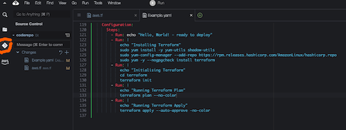
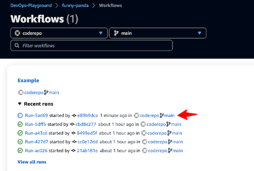
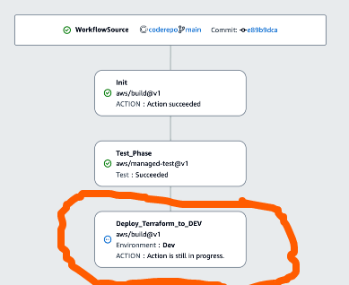
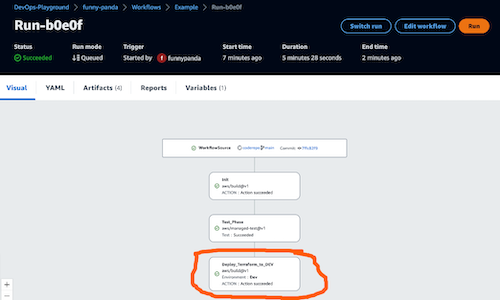
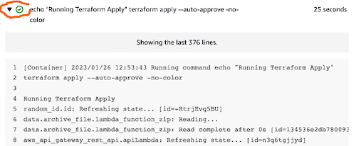

# Exercise 4
[(_back to main readme_)](../README.md)

We now have validated code in our workflow, we're ready for the final step which is to add an action to deploy the code to our AWS account.

We have already linked an AWS account to our CodeCatalyst environment, so we can add a new action which will deploy our code.

Since we have the IDE open, we'll edit in this to demonstrate how we can interact with our workflows.

---

1. If you look in the explorer pane, you'll see our `coderepo`. 

2. Open the file `coderepo/terraform/aws.tf` which should look like
```
provider "aws" {
    region = "eu-west-1"
    default_tags {
        tags = {
            Project = "DevOps PlayGround Jan 2023"
        }
    }
}

terraform {
  backend "s3" {
    bucket         = "204521158369-eu-west-1-terraform-state"
    key            = "devops-playground.tfstate"
    region         = "eu-west-1"
  }
}
```
3. Modify the `key` field and add your panda name in front of the key, so it looks like `funky-panda-devops-playground.tstate`
4. Save the file, either by using a shortcut `CTRL-S` for windows, `Cmd-S` for macs, or using the `File` menu at the top of the screen and choosing `Save`.
5. If you look in the explorer tab, you'll see a folder called `.codecatalyst/workflows`. Open that, and you should see a file called `Example.yaml`. This is our workflow definition file.
 Open your workflow file, scroll to the bottom and add this text
```
  Deploy_Terraform_to_DEV:
    Identifier: aws/build@v1
    Outputs:
      AutoDiscoverReports:
        Enabled: true
        ReportNamePrefix: rpt
    Compute:
      Type: EC2
    Environment:
      Connections:
        - Role: CodeCatalystDeploymentRole
          Name: "204521158369"
      Name: Dev
    DependsOn:
      - Test_Phase
    Inputs:
      Sources:
        - WorkflowSource
    Configuration:
      Steps:
        - Run: echo "Hello, World! - ready to deploy"
        - Run: |
            echo "Installing Terraform"
            sudo yum install -y yum-utils shadow-utils
            sudo yum-config-manager --add-repo https://rpm.releases.hashicorp.com/AmazonLinux/hashicorp.repo
            sudo yum -y --nogpgcheck install terraform
        - Run: |
            echo "Initialising Terraform"
            cd terraform
            terraform init
        - Run: |
            echo "Running Terraform Plan"
            terraform plan -no-color
        - Run: |
            echo "Running Terraform Apply"
            terraform apply --auto-approve -no-color

```
6. Save the file, either by using a shortcut `CTRL-S` for windows, `Cmd-S` for macs, or using the `File` menu at the top of the screen and choosing `Save`.
7. We now need to push our changes back to the main repository. Click on the git icon in the explorer pane.



8. Click on the plus signs next to the `aws.tf` and `Example.yaml` files showing in the `changes` area, which will stage the files.
9. Enter a message in the commit section and press `CTRL-Enter` or `Cmd-Enter` if you're on Windows or Mac respectively.
10. If you look at the bottom of the screen in the status area, you should see that our local code is now 1 commit ahead of the main repo. Click on the `refresh` symbol to push the changes.
11. Alternatively, we could have used standard `git add`, `git commit` and `git push` commands in the terminal.
12. Change back to our original tab, and from the `CI/CD` area, choose `Workflows` and we should see a run in progress, or just completed.



13. Click on the latest run-id, and monitor the progress.



14. Once the final stage is showing as complete, click on it to open the `Deploy_Terraform_to_DEV` action



15. Click on the arrow next to the `Running Terraform Apply` stage to review the output from the terraform apply which deploys our code to the AWS account.



16. Scroll to the bottom of the apply output and you should see an `Outputs` section. Note the value shown in the `api_gateway_url` section.


17. You can either run a `curl api_gateway_url` (replacing api_gateway_url with the appropriate value ) via the dev environment, or use a tool such as https://restninja.io to test the API.


**Congratulations - we've now tested and deployed python and Infrastructure as Code to an AWS account via CodeCatalyst.**


[(_back to main readme_)](../README.md)